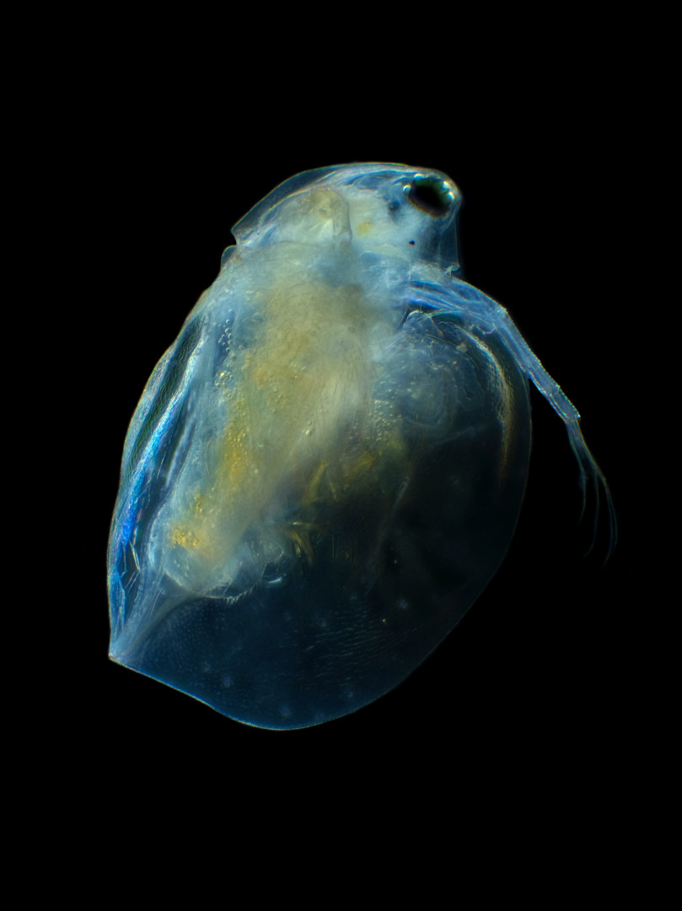
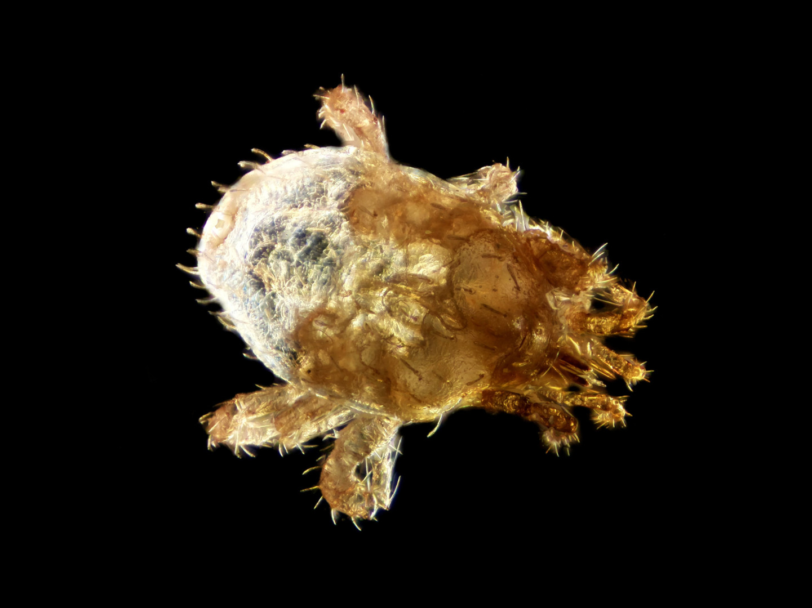
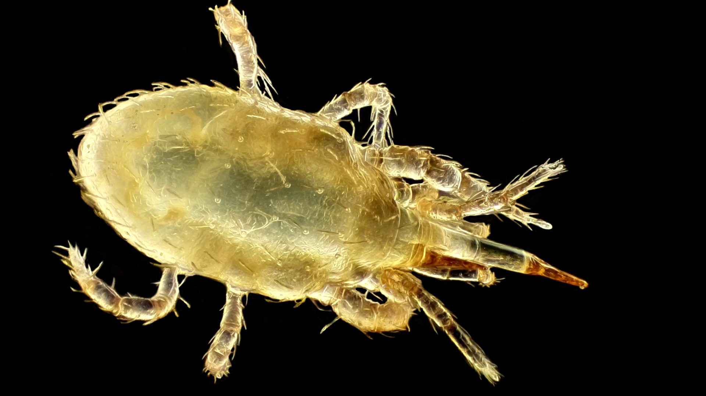
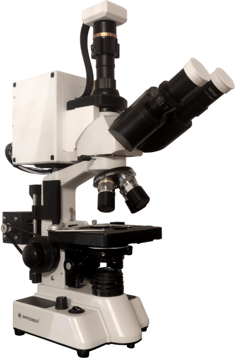
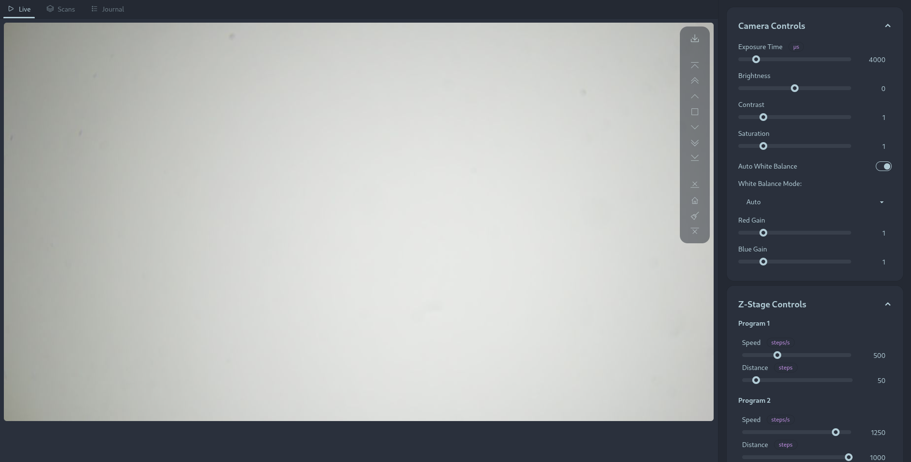

# Microscope automation project

This is a small passion project of mine in which I implement a few automations to my Bresser Researcher Trino 40-1000x. A few design-goals are:

- Minimally intrusive in the sense that the changes to the microscope should be revertible as much as possible.
- The microscope should still be fully usable in the original (analogue) way.

## Gallery

A few composite images obtained by focus stacking:

| Daphnia | Spider mite | Unknown mite |
|---------|-------------|--------------------------|
|  |  |  |
| *Notes:* The sample was treated with bleach in order to immobilize organisms. Brownian motion was prevented by stabilizing the sample in Xanthan gum. | *Notes:* The sample was frozen to immobilize the specimen. It was taken from one of my house plants. | *Notes:* The sample was collected from the soil in one of my house plants. It was immobilized by freezing. Possibly of the order Mesostigmata. |

## Hardware

### Electronics

The control electronics is split between two controllers. The low-level control is handled by an ESP32 microcontroller, with the stepping motors being driven by TMC2208 stepper drivers.

The high-level control is handled by a Raspberry Pi 4, however the housing also allows for the installation of a Jetson Nano device instead of the Raspberry Pi.

The Raspberry Pi and ESP32 communicate over a serial connection (UART) using a custom protocol.

## Software

### User interface and backend

The user interface is a web application served by the Raspberry Pi. The frontend is built using Svelte, Tailwind CSS and DaisyUI. The backend is a Rust application using the Axum framework.

### Firmware

The ESP32 firmware is written in Rust using the `esp-idf` framework and embassy.

## Roadmap / Ideas for future work

- [x] Motorized z-axis with endstops for focusing
- [x] Web interface for controlling the microscope
- [x] Live view from camera with controls for exposure, gain, white balance, etc.
- [x] Z-stack acquisition
- [ ] Build custom focus knob which interacts with the microcontroller to allow for manual focusing when not using the web interface.
- [ ] Motorized stage for x/y movement
- [ ] Build custom stage knobs which interact with the microcontroller to allow for manual x/y
- [ ] Objective turret slot detection
- [ ] Substage illumination control
- [ ] Incident illumination
