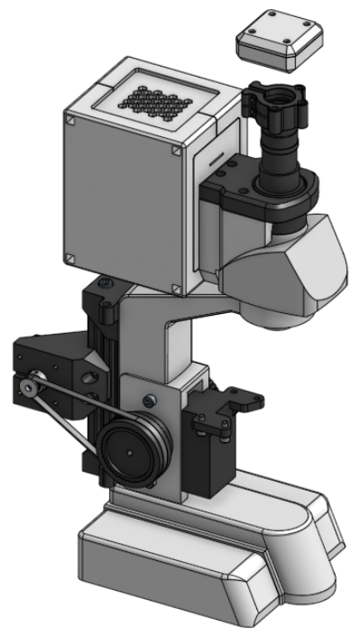

# CAD Models

Most CAD models for this project are made in Onshape, however at some point, I would like to migrate to OpenSCAD for better version control and project portability.

The Onshape project can be found [here](https://cad.onshape.com/documents/6a7b17c2abfc874842839c22/w/c10742419820c2ced297c4e5/e/144f9c4804ce72fdaecba7c3).

