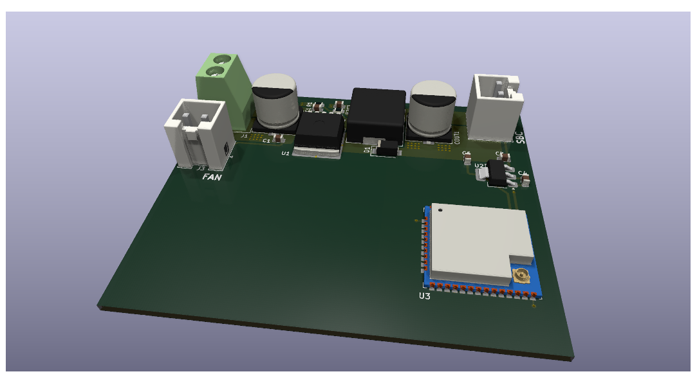

# Hardware specifications

## Mechanical components

Most of the parts are 3D printed, however a few are laser cut from acrylic sheet.
Eventually, I plan to either make all of them 3D-printable and if acrylic sheets
are needed, they should be designed such that they can be cut out by hand as well
(e.g. the side panels for the electronics enclosure).

### BOM

| Part | Description | Quantity |
|------|-------------|----------|
|      |     |          |
|      |     |          |

## Driver board

The driver board is not yet finished and so far only the power supply part is
designed, however it still needs some review, since I'm not an expert in PCB
design. The micro-controller is an ESP32-WROOM module, since the firmware is
written in Rust and the Espressif toolchain for Rust is quite mature.

### BOM

| Part | Description | Quantity |
|------|-------------|----------|
|      |     |          |
|      |     |          |
